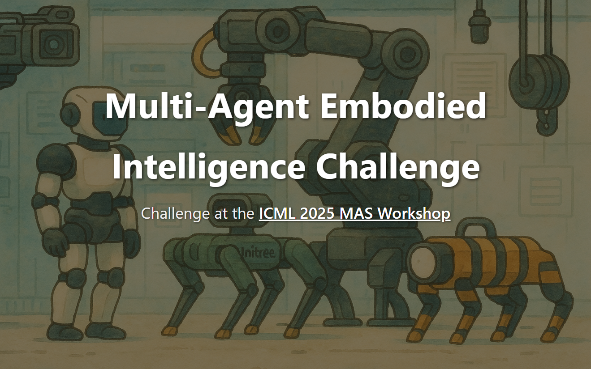
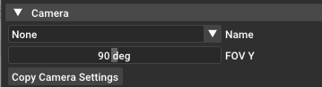

# Multi-Agent Embodied Intelligence Challenge



This repository contains the code for Multi-Agent Control Track of the  [ICML Multi-Agent Embodied Intelligence Challenge](https://mars-eai.github.io/MARS-Challenge-Webpage/)

This track focuses on low-level policy execution in physically realistic simulation environments. It utilizes RoboFactory, a simulation benchmark for embodied agents. Participants are required to deploy and control multiple embodied agents (e.g., robotic arms) to collaboratively complete manipulation-centric tasks like block stacking.

Each task is an episode where agents interact with dynamic objects in a shared workspace under partial observability and randomized conditions. The core challenge lies in achieving robust, learned coordination across multiple agents.


## 🗓️ Competition Timeline

| Date            | Phase             | Description                                                                 |
|-----------------|-------------------|-----------------------------------------------------------------------------|
| August 1st      | Warmup Round      | Environment opens for teams to explore and get familiar (no prizes).        |
| September 1st   | Official Round    | Competition begins with unseen tasks and prize challenges.                  |
| late October (TBD)  | Official Round Ends | Expected closing of the official round.                                    |
| December        | Award Ceremony    | Final results and awards will be announced.                                 |

## Installation

### 1. Clone the Repository:

First, install [vulkan](https://maniskill.readthedocs.io/en/latest/user_guide/getting_started/installation.html#vulkan). 
The repository contains submodules, thus please check it out with

```bash
# HTTP
# Use --recurse to clone submodules
git clone https://github.com/FACEONG/MARS-Challenge-Control-Track.git --recurse
```

or

```bash
# SSH
git clone git@github.com:FACEONG/MARS-Challenge-Control-Track.git --recurse
```

### 2. Create a conda environment:

```bash
conda create -n mars python=3.10
conda activate mars
```

### 3. Install dependencies:

```bash
cd RoboFactory/
pip install -r requirements.txt
```

### 4. Download assets:

```bash
python script/download_assets.py 
```

### 5. Check the Environment by Running the following line (need graphical desktop)

```bash
python script/run_task.py configs/table/take_photo.yaml
```

### 🛠 Installing OpenGL/EGL Dependencies on Headless Debian Servers

If you are running simulation environments on a **headless Debian server** without a graphical desktop, you can try to install a minimal set of OpenGL and EGL libraries to ensure compatibility.

Run the following commands to install the necessary runtime libraries:

```bash
sudo apt update
sudo apt install libgl1 libglvnd0 libegl1-mesa libgles2-mesa libopengl0
```
Then you can check the environment by running the code in next section (Data Generation).

## Data Generation (RoboFactory)

**Available Tasks for Warmup Round:**
- `long_pipeline_delivery`
- `place_food`
- `take_photo`
- `three_robots_stack_cube`

You can use the following command to run the tasks using the expert policy solution

```bash
python script/run_task.py configs/table/[task name].yaml
```

Use the following Commands to generate datas

```bash
python script/generate_data.py configs/table/[task name].yaml [number of trajectories] --save-video
# Example:  python script/generate_data.py configs/table/place_food.yaml 100 --save-video

# Multi-processing
python script/generate_data.py configs/table/[task name].yaml [number of trajectories]  --save-video --num-procs [number of processes]
```
The generated raw data will be saved by default in the demo/ directory.


## Training the Baseline Policy (Policy-Lightning)

The baseline policy for this project is implemented using the Policy-Lightning framework. 

For now, policy provided is a 2D image-based diffusion policy. This policy is a global policy that takes camera images from all agents and uses a single diffusion model to control all agents jointly. The implementation can be found in the `Policy-Lightning` folder. We plan to support more policies soon.

To learn more about the Policy-Lightning framework, please refer to  [Policy-Lightning/README.md](Policy-Lightning/README.md).


###  1. Data Preparation

First, create a data folder (like data/), then convert the generated raw data into the training format:

```bash 
python Policy-Lightning/script/image/extract.py --dataset_path [path_to_raw_data] --output_path [path_to_output_data] --load_num [number_of_episodes] --agent_num [number_of_agents]

# Example:  python Policy-Lightning/script/image/extract.py --dataset_path demos/PlaceFood-rf/motionplanning/xxx.h5 --output_path data/place_food.h5 --load_num 100 --agent_num 2
```

For a comprehensive explanation of the data format for training, please refer to [docs/data_convert.md](docs/data_convert.md).


### 2. Training
**2D Diffusion Policy:**

```bash
# General format:
python Policy-Lightning/workspace.py --config-name=[policy_config] task=[task_name]

# Example:
python Policy-Lightning/workspace.py --config-name=dp2 task=place_food
```

### 3. Evaluation

You can evaluate your trained checkpoints from policy-lightning using the `eval_policy_lt.py` script provided in the project root. This script allows you to run your policy in the simulation environment and report performance metrics.

Before running the evaluation, make sure to **configure the arguments at the top of `eval_policy_lt.py`** to match your experiment settings (e.g., checkpoint path, number of agents, data location, etc.).


```bash
python eval_policy_lt.py --ckpt_path=[checkpoint path] --config=[task config] --max_steps=[policy try max steps]
```


## Implement Your Own policy

You can implement your own policy under the `custom_policy` directory. This folder contains a `deploy_policy.py` file, which provides an interface for integrating your custom policy with the evaluation and training framework. 

To adapt your policy to the framework, simply wrap your policy logic within the interface provided by `deploy_policy.py`. This ensures compatibility with the rest of the system and allows you to evaluate your policy using the provided scripts (such as `eval_policy.py`).

For example, you can check the `deploy_policy.py` file under the `Policy-Lightning` folder, where there is an example of how to wrap your policy.

After training, you can use the eval_policy.py to eval your custom policy， you should also make sure to **configure the arguments at the top of `eval_policy.py`** to match your experiment settings. 

**Note: Reserve the method "update_obs", "get_action", and "reset" for policy execution.**


## (Optional) Camera Configuration

### Customizing Agent Camera Positions and Angles

To adjust the position and orientation of agent cameras in your simulation, follow these steps:

1. **Launch the Interactive Environment**

   Run the following command to open the graphical interface for your task:

   ```bash
   python script/run_task.py configs/table/[task name].yaml
   ```

   This will launch a window where you can visualize and interact with the simulation environment.

2. **Review and Adjust Camera Settings**

   - Use the built-in camera widget to inspect the current camera configuration for each agent.
   - You can manually move and rotate the cameras within the interface to achieve your desired viewpoint.

   

3. **Copy and Apply Camera Configuration**

   - Once you are satisfied with the camera's position and angle, click the **"Copy Camera Setting"** button in the interface.
   - This will output a camera configuration snippet similar to:

     ```
     camera = add_camera(name="", width=1920, height=1080, fovy=1.57, near=0.1, far=1e+03)
     camera.set_local_pose(Pose([0.345104, 0.239462, 0.240109], [0.34335, 0.0538675, 0.0197297, -0.937454]))
     ```

   - Extract the pose parameters (the two lists inside `Pose([...], [...])`) and update the corresponding camera entry in your task config file (`configs/table/[task name].yaml`).
   - **Important:** Set the `type` field to `"pose"` in the YAML configuration.

   **Example YAML camera configuration:**

   ```yaml
   - uid: head_camera_agent1
     pose:
       type: pose
       params: [[0.345104, 0.239462, 0.240109], [0.34335, 0.0538675, 0.0197297, -0.937454]]
     width: 320
     height: 240
     fov: 1.5707963268
     near: 0.1
     far: 10
   ```


   Repeat this process for each camera you wish to customize.

**If you are using the baseline policy through policy lightning**, please remember to modify the task config of policy-lightning through `Policy-Lightning\config\task` to match up with your camera shape.

During evaluation for the contest, your camer configuration will be **extracted and be used to evaluate your policy**.

## (Optional) Customizing Data Generation

Episode generation is driven by expert rule-based policies—Python scripts that specify sequences of actions to solve each task. The default expert policies are located in the `planner/solutions` directory. Each `.py` file in the folder implements an expert policy as a solution for a task.

You are encouraged to modify and improve these scripts, to generate your own data that best suits your approach.

You can use the following command to run the tasks using the expert policy solution

```bash
python script/run_task.py configs/table/[task name].yaml
```

## Contact

If you have any questions, feel free to email us on <icmlmarschallenge@gmail.com>.
